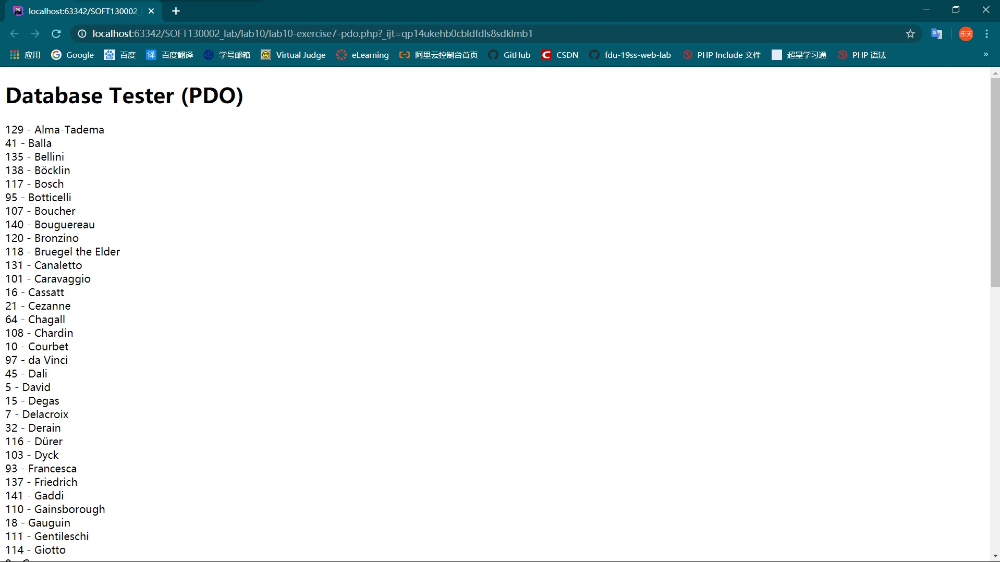
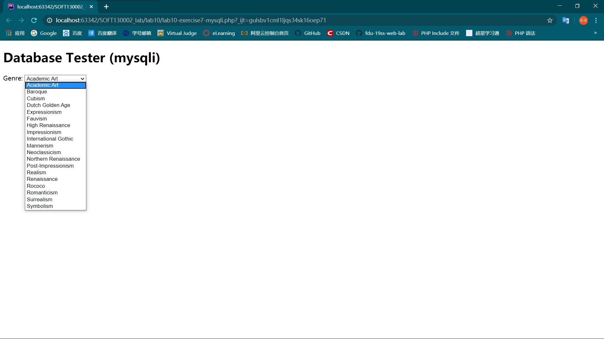
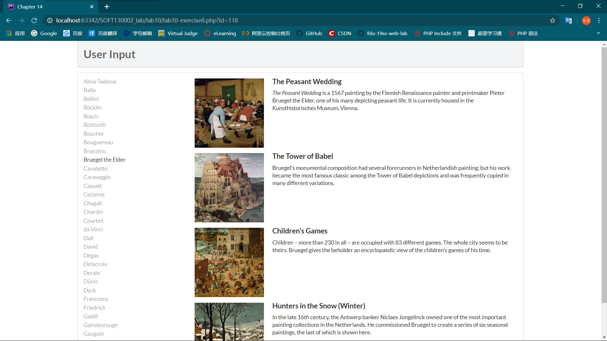
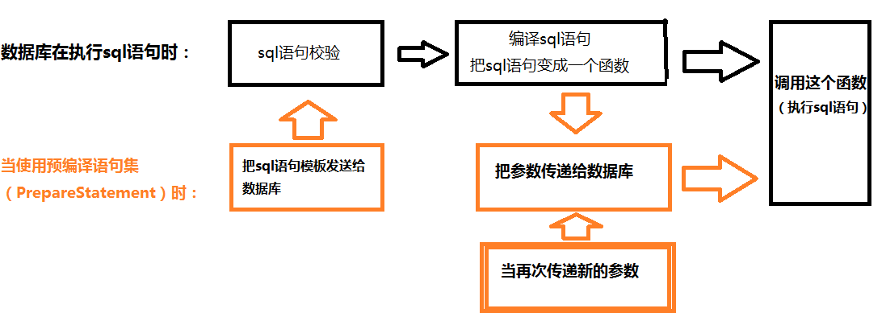
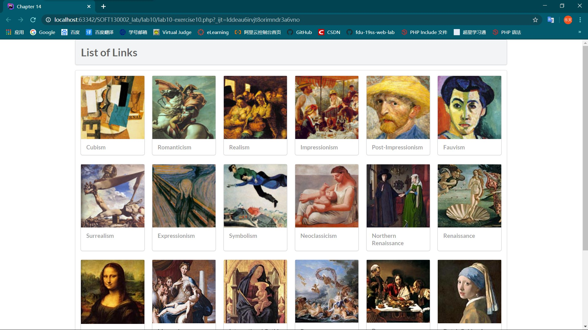

# lab10设计文档

> 袁乐天 19302010019

## Exercise 7

### 截图

### 分析

图一是用PDO的API链接数据库，用<code>fetch()</code>方法遍历数据，用`$pdo = null;`来注销连接。

图二是用mysqli的API链接数据库，用<code>mysqli_fetch_assoc()</code>方法遍历数据，用`mysqli_close($connection);`来注销连接。

## Exercise 8

### 截图

### 分析

首先获取所有画家的名称，并为每个名称添加url，并指定不同的id参数。

当点击名称时，向服务器请求并传递id参数，并且在右边显示出画家的作品。

`outputArtists`函数使用`select * from Artists order by LastName limit 0,30`来查询数据库，`limit 0,30`表示返回第0~30个结果。然后遍历结果，将其显示在页面左边，并附上不同id参数的url。

`outputPaintings`函数使用`'select * from Paintings where ArtistId=' . $_GET['id']`来查询数据库中指定id的画家的作品。然后遍历每个作品，调用子函数`outputSinglePainting`。

`outputSinglePainting`函数主要是将一个作品显示在右边。函数使用了`''`，这表示图片本身并没有没存储在数据库里，是存放在服务器本地的。

## Exercise9

### 分析

这类语句被称为SQL预处理（或预编译）。简要原理如下：

优点如下：

* 预处理语句大大减少了分析时间，只做了一次查询（虽然语句多次执行）。
* 绑定参数减少了服务器带宽，你只需要发送查询的参数，而不是整个语句。
* 预处理语句针对SQL注入是非常有用的，因为参数值发送后使用不同的协议，保证了数据的合法性。

## Exercise10

### 截图

### 分析

图片按照`GenreID`降序排列了。