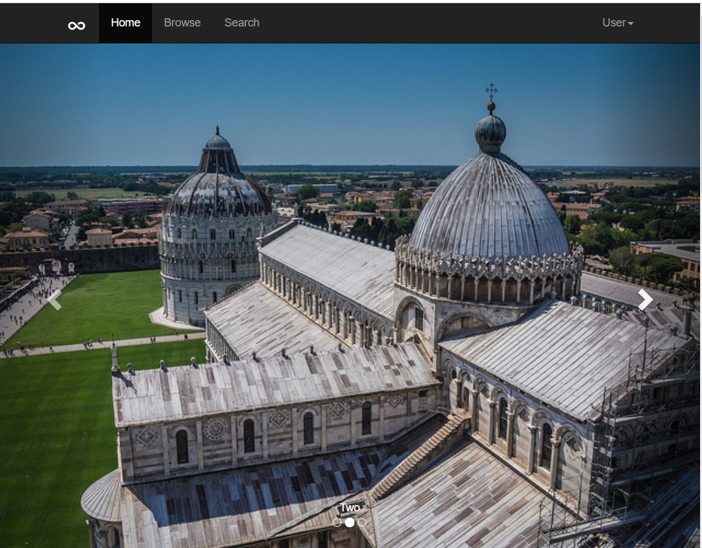
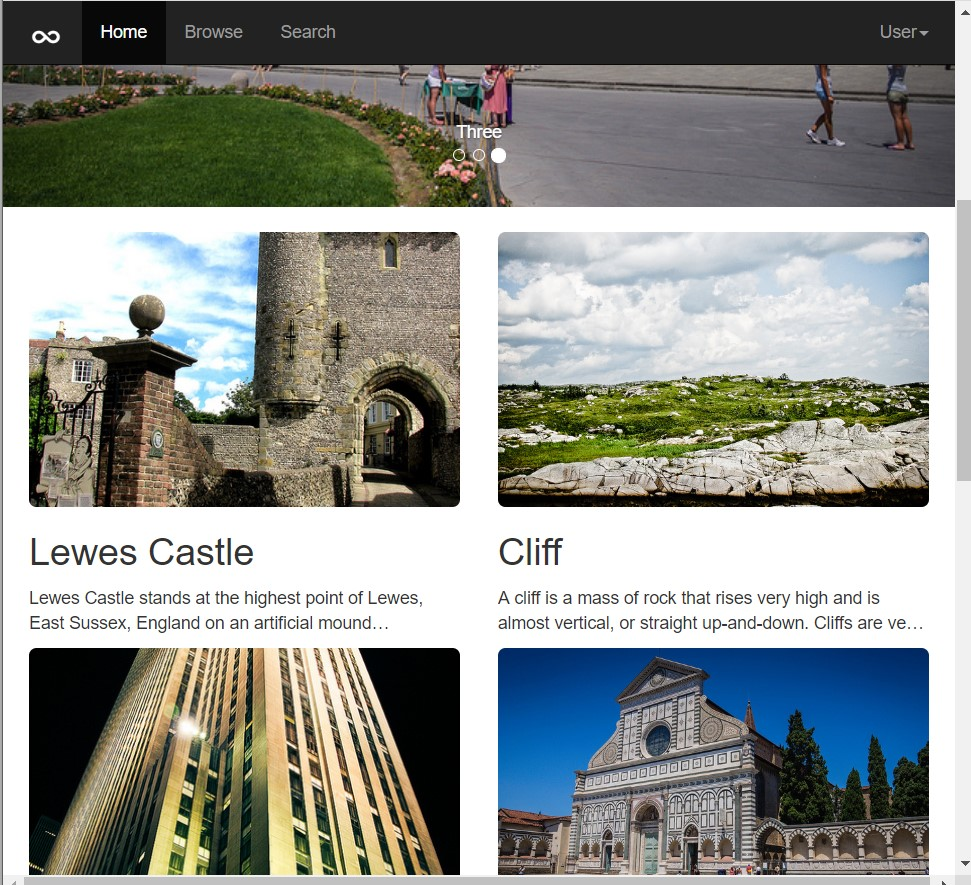
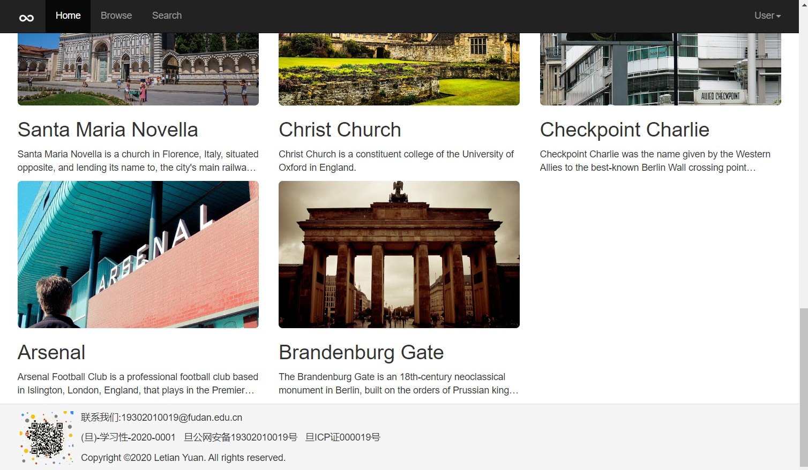

# Lab4设计文档

> 袁乐天 19302010019

## 主页截图

### 截图1



### 详细信息

* 导航栏的class为

```css
navbar navbar-inverse navbar-fixed-top
```

其中 **navbar-inverse** 表示取反色，**navbar-fixed-top**表示导航栏始终置顶

* 下拉栏的class为

```css
dropdown
```

* 滑动图片的代码主要使用该模板下的css代码[https://v3.bootcss.com/examples/theme/#carousel-example-generic](https://v3.bootcss.com/examples/theme/#carousel-example-generic)

### 截图2



* 图片大小的class为

```css
col-xs-6 col-lg-4
```

其中 **col-xs-6** 表示当屏幕较小时（截图2），图片宽度为 **12/6** ， **col-lg-4 **表示当屏幕较大时（截图3），图片宽度为 **12/4**

> xs (phones), sm (tablets), md (desktops), and lg (larger desktops)

### 截图3



* footer的class为

```css
panel-footer
```

这样子footer的底色为#F5F5F5，且footer的上部有一条横线，较为好看

* footer中图片的class为

```css
pull-left
```

这表示将图片靠左摆放