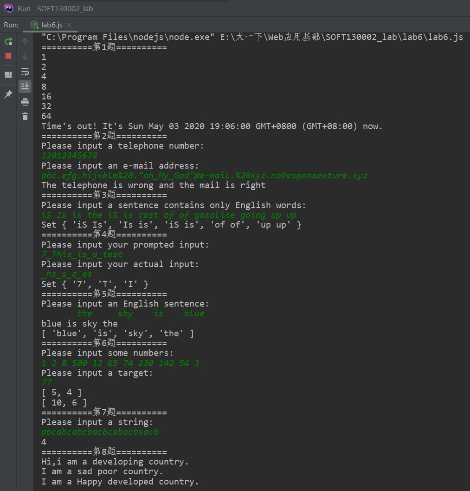

# lab6设计文档

> 袁乐天 19302010019

## 第一题

用了Promise与await来确保在test函数中执行完第一题后才去执行第二题的代码

## 第二题

* 手机号码

  中国电信号段
  133、1349、1410、149、153、162、170(0-2)、173、174(0-1)、177、180、181、189、190、191、193、199
  中国联通号段
  130、131、132、140、145、146、155、156、166、167、170(4.7-9)、171、175、176、185、186、196
  中国移动号段
  134(0-8)、135、136、137、138、139、1440、147、148、150、151、152、157、158、159、165、170(3.5.6)、172、178、182、183、184、187、188、195 [1]  、197、198
  中国广电号段
  192

  故手机号码没有 10、11、12开头的情况，其正则表达式为

  ```js
  ^1[3456789]\d{9}$
  ```

  首位为1，第二位为3、4、5、6、7、8、9中的某个数字，其后紧跟9个数字，共11位

* 邮箱

  这大概是整个lab最难的部分了，因为邮箱的格式千奇百怪，我所查找到的一些邮箱有

  ```
  bounceback@response.unity3d.com  二级域名超过3个字母
  bounces+15762298-e583-letianyuan877=qq.com@sgmail.github.com  @前面含有特殊字符
  beian@mail1.beian.miit.gov.cn  具有五级域名
  Microsoft@e-mail.microsoft.com  @右面具有特殊字符
  bounce+e62414.f6e74b-877517032=qq.com@mg.leetcode-cn.com  更加复杂的情况
  ```

  因而我使用了助教在lab2中给出的邮箱正则表达式

  ```js
  ^([^\x00-\x20\x22\x28\x29\x2c\x2e\x3a-\x3c\x3e\x40\x5b-\x5d\x7f-\xff]+|\x22([^\x0d\x22\x5c\x80-\xff]|\x5c[\x00-\x7f])*\x22)(\x2e([^\x00-\x20\x22\x28\x29\x2c\x2e\x3a-\x3c\x3e\x40\x5b-\x5d\x7f-\xff]+|\x22([^\x0d\x22\x5c\x80-\xff]|\x5c[\x00-\x7f])*\x22))*\x40([^\x00-\x20\x22\x28\x29\x2c\x2e\x3a-\x3c\x3e\x40\x5b-\x5d\x7f-\xff]+|\x5b([^\x0d\x5b-\x5d\x80-\xff]|\x5c[\x00-\x7f])*\x5d)(\x2e([^\x00-\x20\x22\x28\x29\x2c\x2e\x3a-\x3c\x3e\x40\x5b-\x5d\x7f-\xff]+|\x5b([^\x0d\x5b-\x5d\x80-\xff]|\x5c[\x00-\x7f])*\x5d))*(\.\w{2,})+$
  ```

  以@为界分为两个部分，分别是

  ```js
  ([^\x00-\x20\x22\x28\x29\x2c\x2e\x3a-\x3c\x3e\x40\x5b-\x5d\x7f-\xff]+|\x22([^\x0d\x22\x5c\x80-\xff]|\x5c[\x00-\x7f])*\x22)(\x2e([^\x00-\x20\x22\x28\x29\x2c\x2e\x3a-\x3c\x3e\x40\x5b-\x5d\x7f-\xff]+|\x22([^\x0d\x22\x5c\x80-\xff]|\x5c[\x00-\x7f])*\x22))*
   
  \x40([^\x00-\x20\x22\x28\x29\x2c\x2e\x3a-\x3c\x3e\x40\x5b-\x5d\x7f-\xff]+|\x5b([^\x0d\x5b-\x5d\x80-\xff]|\x5c[\x00-\x7f])*\x5d)(\x2e([^\x00-\x20\x22\x28\x29\x2c\x2e\x3a-\x3c\x3e\x40\x5b-\x5d\x7f-\xff]+|\x5b([^\x0d\x5b-\x5d\x80-\xff]|\x5c[\x00-\x7f])*\x5d))*(\.\w{2,})+
  ```

  这其中有许多相同的部分，把他提取出来，即以下三个表达式

  ```js
  [^\x00-\x20\x22\x28\x29\x2c\x2e\x3a-\x3c\x3e\x40\x5b-\x5d\x7f-\xff]+
  ```

  它表示不含控制字符，空白字符（换行、换页、空格、制表符等），双引号，左括号，右括号，逗号，句号，冒号，分号，小于，大于，@号，左方括号，反斜杠，右方括号，以及\x80-\xff中ASCII码中未定义的字符

  即**不含特殊字符的正常的一段邮箱表达式**

  把上式记做  (X1) ​ 来化简正则表达式

  ```js
  \x22([^\x0d\x22\x5c\x80-\xff]|\x5c[\x00-\x7f])*\x22
  ```

  他表示两个双引号中间的内容不含“回车键，双引号，反斜杠以及ASCII码中未定义的字符”或者是“含有反斜杠以及任意一个ASCII码字符”

  即**含有双引号以及双引号中的内容**

  把上式记做  (X2) 来化简正则表达式

  ```js
  \x5b([^\x0d\x5b-\x5d\x80-\xff]|\x5c[\x00-\x7f])*\x5d
  ```

  他表示两个双方括号中间的内容不含“回车键，左方括号，反斜杠，右方括号以及ASCII码中未定义的字符”或者是“含有反斜杠以及任意一个ASCII码字符”

  即**含有方括号以及方括号中的内容**

  把上式记做  (X3)  来化简正则表达式

  所以原式可以简化为

  ```
  ( (X1) | (X2) )(\x2e( (X1) | (X2) ))*
  
  \x40( (X1) | (X3) )(\x2e( (X1) | (X3) ))*(\.\w{2,})+
  ```

  这表示，邮箱的@符号之前必须以  X1  或 ​ X2 ​开头，其后可以有一个句号(\2e)，句号后面可以有  X1  或  X2  并重复多次

  比如  abc.efg.hij=klm%20  就满足  ( (X_1) | (X_2) )(\\.( (X_1) | (X_2) ))* 

  邮箱的@符号之后必须以  X1  或  X3  开头，其后可以有一个句号(\2e)，句号后面可以有  X1  或  X3  并重复多次，并且邮箱的顶级域名的字母数量必须大于2

  比如  @1.t ​ 是不合法的， @1.top  是合法的，  @e-mail.%20xyz.noResponse=ture.xyz  是合法的

  所以类似于以下这样的邮箱是合法的

  ```js
  abc.efg.hij=klm%20."oh_My_God"@e-mail.%20xyz.noResponse=ture.xyz
  ```

## 第三题

> 个人认为这道题用Set和正则表达式来做会增加时间复杂度，使其为T(2n)，实际上存在T(n)​的算法

正则表达式为

```js
/(\b[a-z]+\b) (\1)\b/gi
```

* 其中\1表示匹配第一个分组（即第一个括号）里所匹配到的字符，通过(...) \1的形式来匹配重复两次的一段内容
* \1匹配的是字符，是不含边界的，因此需要在\1后再加一个\b
* g表示匹配全局，i表示忽略大小写
* 之所以不用预查（即/(\b[a-z]+\b)(?= \1\b)/gi），是因为我需要把所匹配到的两段内容全部输出，而对于“Is is IS”这种情况，通过改变reg的lastIndex属性来实现匹配两次

对于“如果集合中元素超过10个，则按照首字母顺序取前10个于集合”这个要求，下面的代码就可以做到了。其中sort是默认按照Unicode序来排序的，而不是首字母顺序，所以需要传入比较函数来忽略大小写。

```js
result = new Set(Array.from(result).sort(cmp).slice(0, 10));
```

## 第四题

这道题使用Set的目的是大大简化查找的次数。比如将“aaaabbbbbbbbcccccccccccddddddddd"放入一个Set中就可以简化为值查找四次，即a、b、c、d

```js
let upperCaseActualInput = new Set(actualInput.toUpperCase());
console.log(new Set(Array.from(new Set(wantInput.toUpperCase())).filter(e => !upperCaseActualInput.has(e))));
```

我利用Array的filter函数来把wantInput中的actualInput部分去除，剩下就是答案了

## 第五题

> 按照题目要求调用Array的内置函数即可
>
> 由于不清楚题目意思，我将数组和反转后的字符串都打印了出来

## 第六题

> 哈希表模板题

## 第七题

> 集合（这里Map起到的作用只有它的key值，所以是集合）模板题

## 第八题

> “借用构造函数继承”，“原型链继承”与“原型式继承”

## 总结

* 各个正则表达式的解释

  见上文

* 继承不同方式的理解

  * 借用构造函数
    * 函数也是一个对象，因而可以用apply()和call()在新创建的对象上执行构造函数
    * 其优点是传递参数
    * 其缺点是函数不能够被复用
  * 原型链继承
    * 利用原型让一个引用类型继承另一个引用类型的属性和方法
    * 它是ECMAScript中实现继承的主要方法，利用了原型搜索机制
    * 其缺点是父类中的引用类型会被所有实例共享
  * 原型式继承
    * 从现有的对象中创建新对象，不必创建自定义类型
    * 其优点在于没有必要兴师动众地创建一个构造函数
    * 其缺点是包含引用类型值得属性始终会共享相应的值

* Map、Set、Array之间的区别和使用

  * Map

    * Map是一个键值对的集合，键值是惟一的，能够实现在O(1)​时间复杂度内查找元素。

    * 常用的方法有

      * delete

        如果 Map 对象中存在该元素，则移除它并返回 true；否则如果该元素不存在则返回 false。

      * clear

        移除Map对象的所有键/值对 。

      * set

        移除Map对象的所有键/值对 。

      * has

        返回一个布尔值，表示Map实例是否包含键对应的值。

      * get

        返回键对应的值，如果不存在，则返回undefined。

  * Set

    * Set是一个键的集合，键值是惟一的。常用于去除重复元素这一操作中。

    * 常用的方法有

      * add

        在Set对象尾部添加一个元素。返回该Set对象。

      * has

        返回一个布尔值，表示该值在`Set`中存在与否。

  * Array

    * Array是一个数组，它在js中含有非常丰富的内置函数。

    * 常用的方法有

      * Array.from()

        从类数组对象或者可迭代对象中创建一个新的数组实例。

      * 修改

        pop、push、reverse、sort、fill

      * 访问

        join、includes、slice、toString、indexOf

      * 迭代

        forEach、every、filter、find、map、reduce

## github截图


## 本地命令行截图

